      Parte 1 - Conceitos iniciais de Node.js, NPM e Express
 
 # 1. Explique com suas palavras o que é Node.js e qual é sua função em uma aplicação web.
É uma ferramenta utilizada para rodar o JavaScript sem precisar usar o navegador. Na aplicaçao web,
ele controla o backend.

# 2. Qual é a diferença principal entre executar JavaScript no navegador e executar JavaScript com Node.js
No navegador o JS controla a parte do frontend . Serve para criar animações, botões, validações e formularios,
ou seja toda e qualquer interação visual. 

No Node.js o JS mexe com a parte do backend. Serve para criar sistemas e processar dados, tem acesso ao BD e 
aos arquivos do computador, e não possui interface gráfica.

# 3. Explique o que é NPM.
É a biblioteca onde ficam códigos prontos para o Node.js. É onde os programadores 
compartilham códigos que eles criaram e disponibilizam para outros poderem baixar.

 # 4. Explique a função do arquivo package.json.
 Ele funciona como um manual de instrução de um projeto Node.js. Serve para guardar dados basicos do projeto, listar as dependencias e suas versões, o autor do código e os scripts.

# 5. Explique por que a pasta node_modules normalmente não é enviada para o GitHub.
 Porque ela é enorme e  é facil de ser recriada, basta usar um npm i.

#  6. Crie um novo projeto Node.js utilizando npm init -y.
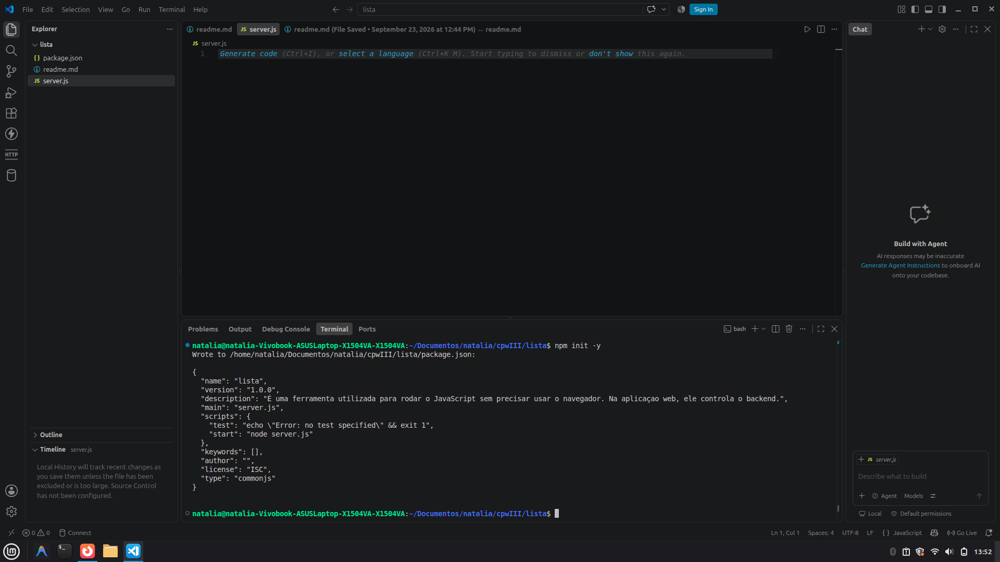

# 7. Instale o Express no projeto.
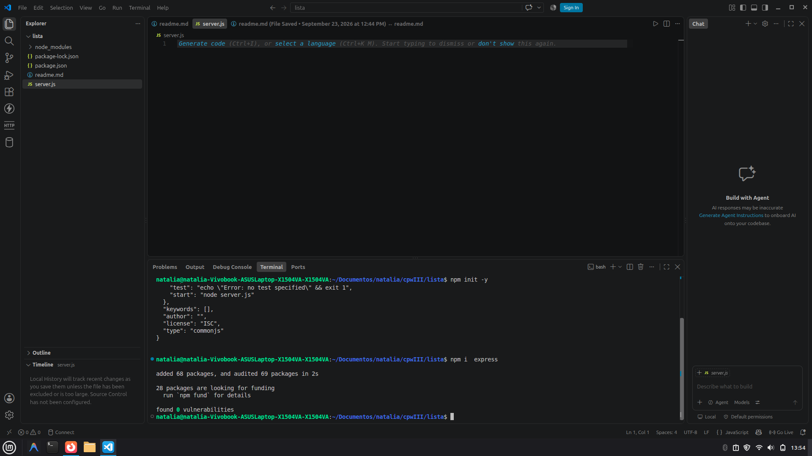

# 8. Crie o arquivo server.js e importe/configure o Express. / 9. Configure o servidor para escutar na porta 3000.
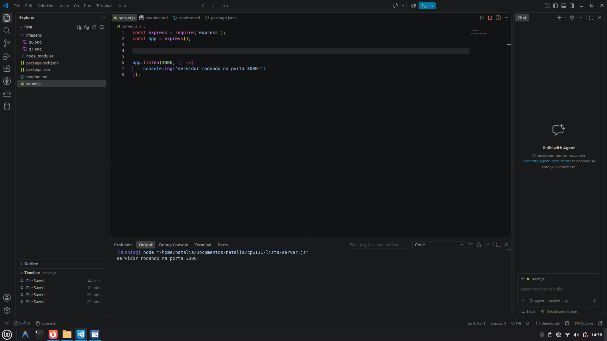 

# 10. Crie a rota GET / que retorne uma mensagem informando que a API está funcionando.
app.get('/', (req,res) =>{
    res.send('API funcionando!')
})
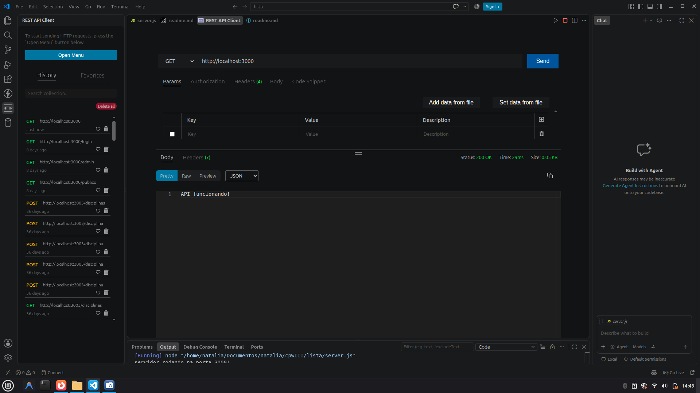
  
      Parte 2 - Rotas, requisições e respostas

# 11. Explique o que é uma rota (endpoint) em uma API.
Uma rota  dentro de uma API é um caminho para acessar um recurso específico. Como se fosse a url de um site, só que
em vez de abrir uma pagina visual, ela executa uma ação no servidor. EX: 'http://localhost:3000/filmes', filmes é a rota.

# 12. Explique a função de req em uma rota Express.
 É um objeto que guarda as informações que estão vindo do cliente e manda para o servidor.

# 13. Explique a função de res em uma rota Express.
É o objeto utilizado pelo servidor para enviar a resposta de volta ao cliente. É através dele que o express devolve o resultado do processamento conforme a rota.

# 14. Explique a diferença entre res.send() e res.json(). 
res.send envia em formato de texto puro e de forma bem simples.  

res.json envia dados estruturados em JSON, que ficam organizados e coloridos. É o padrão em APIs.

# 15. Explique o significado de API REST ou RESTful dentro do conteúdo trabalhado.
 É um sistema que recebe requisições e devolve respostas de dados puros, geralmente em JSON, utiliza métodos HTTP e rotas.

# 16. Associe cada método HTTP à sua finalidade: GET, POST, PUT e DELETE.
  GET: buscar dados

  POST: criar dados   

  PUT: atualizar   

  DELETE: excluir 

# 17. Explique a diferença entre req.body e req.params.
req.body captura os dados ocultos no corpo da requisição   
req.params pega os dados enviados direto na url  

# 18. Explique para que serve app.use(express.json()).
 É um tradutor obrigatório para o express conseguir ler o req.body  
     
     Parte 3 - Estrutura inicial de dados

 # 19. Crie inicialmente um array chamado jogos contendo pelo menos 3 objetos.  Cada jogo deverá possuir: id, titulo, genero, ano e nota.
 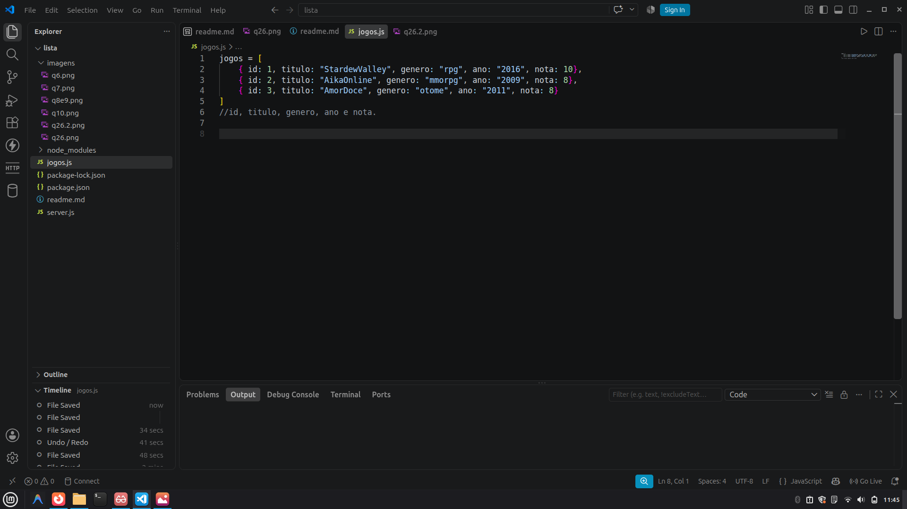

# 20. Crie GET /jogos para retornar todos os jogos.
  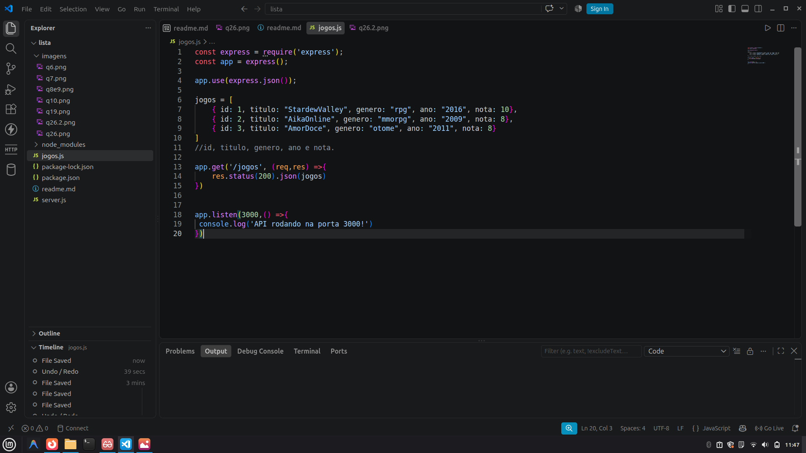

# 21. Teste GET /jogos no Postman.
  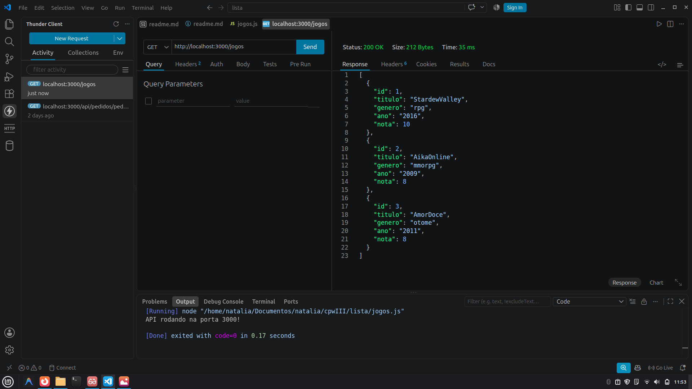

# 22. Crie GET /jogos/:id para buscar apenas um jogo pelo ID. 
# 23. Utilize req.params.id para capturar o ID informado na URL.
# 24. Utilize find() para localizar o jogo.
# 25. Caso o jogo não exista, retorne status 404 e uma mensagem em JSON.

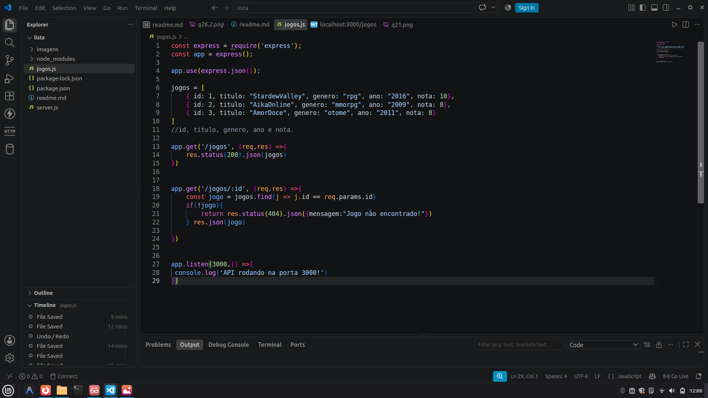  

# 26. Teste no Postman um ID existente e um ID inexistente.
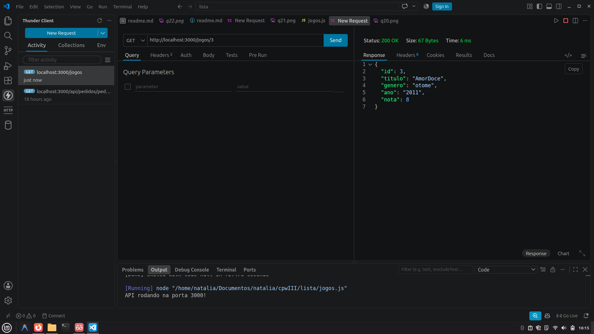  
 # id inexistente
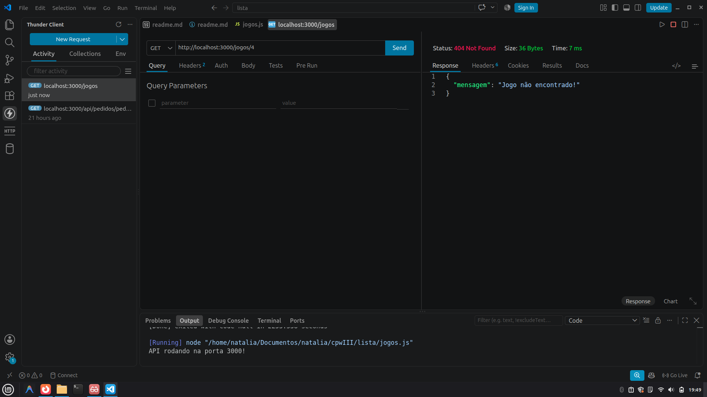

     Parte 4 - POST: criação de dados
 # 27. Crie POST /jogos para cadastrar um novo jogo.
 # 28. O Body deverá ser enviado pelo Postman no formato JSON.
 # 29. Capture os dados utilizando req.body.
 # 30. Crie o ID do novo jogo automaticamente.
# 31. Adicione o novo objeto ao array utilizando push().
# 32. Caso titulo ou genero não sejam enviados, retorne status 400.
# 33. Quando o cadastro for realizado corretamente, utilize status 201.

 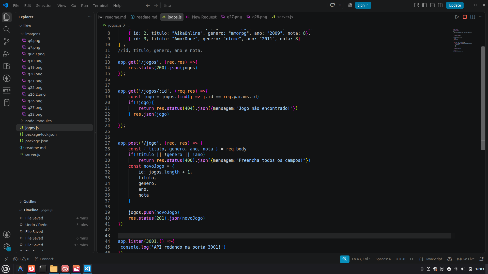   

# 34. Teste no Postman um POST válido.

Exemplo: {"titulo":"Minecraft","genero":"Aventura","ano":2011,"nota":9}
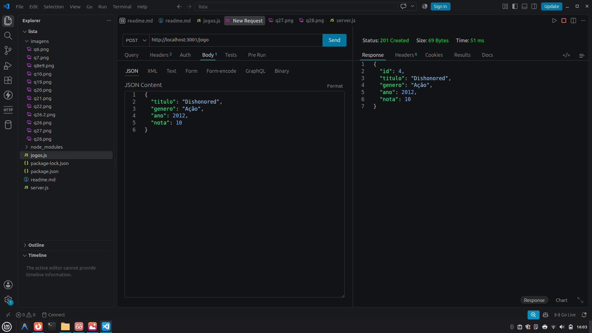 

# 35. Teste no Postman um POST com dados obrigatórios ausentes.
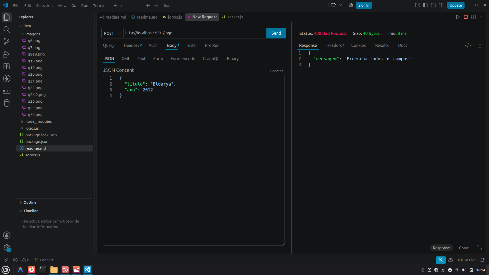   
  
      Parte 5 - PUT: atualização de dados
# 36. Crie PUT /jogos/:id.
# 37. Localize o jogo utilizando o ID recebido por req.params.
# 38. Permita alterar titulo, genero, ano e nota por meio do Body JSON.
# 39. Caso o jogo não exista, retorne status 404.
# 40. Retorne o objeto atualizado após a alteração. 
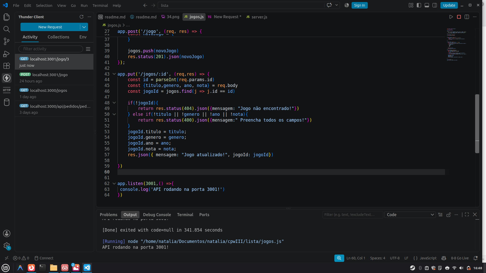  

# 41. Teste no Postman uma atualização válida.
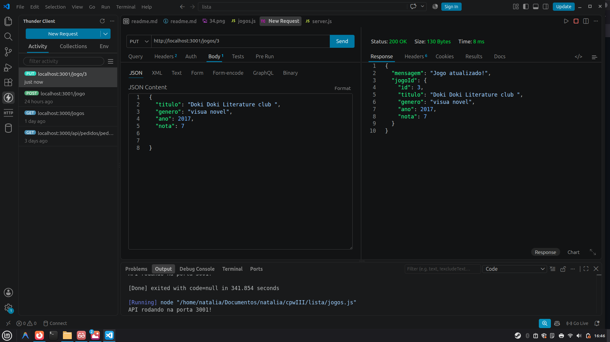 
# 42. Teste uma tentativa de atualização utilizando um ID inexistente.  
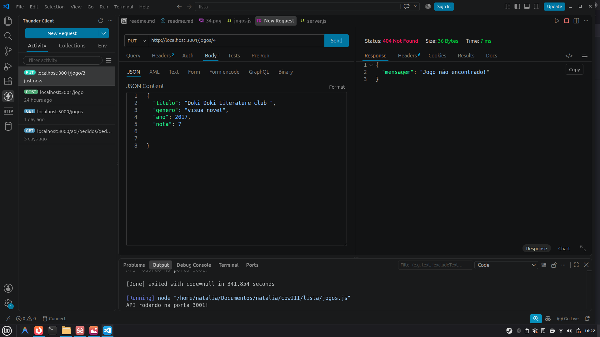 

# 43. Explique por que o PUT é diferente do POST.
 O PUT faz referencia parte de UPDATE do crud, ou seja ele atualiza. Post serve para criar.
     
     Parte 6 - DELETE: exclusão de dados
# 44. Crie DELETE /jogos/:id.
# 45. Utilize findIndex() para localizar a posição do jogo no array.
# 46. Utilize splice() para remover o jogo.
# 47. Caso o ID não exista, retorne status 404.
# 48. Retorne uma mensagem confirmando a exclusão.
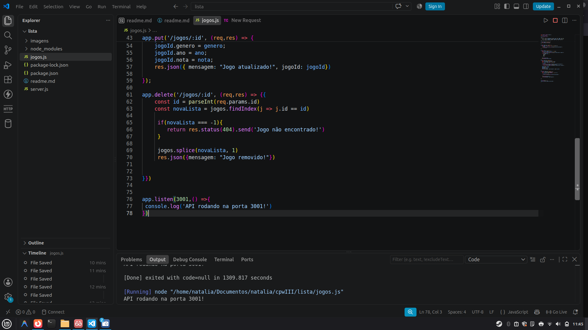  

# 49. Teste o DELETE no Postman.
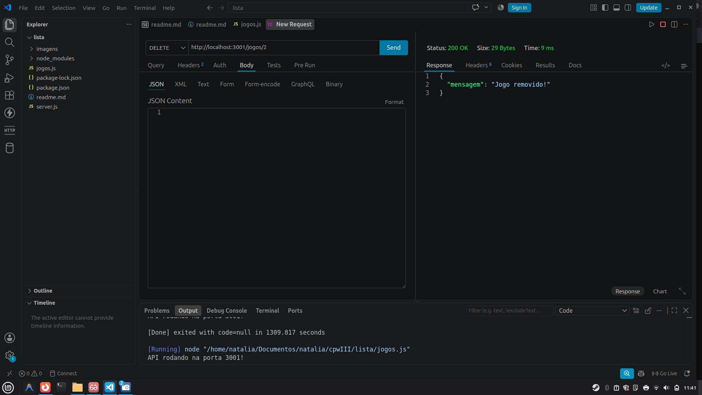  

# 50. Explique por que, neste caso, o DELETE não precisa receber Body.  
Porque o dado é capturado por meio da rota (na URL) e não tem necessidade de pegar pelo body.

# 51. Depois da exclusão, faça um GET /jogos e comprove que o item foi removido.
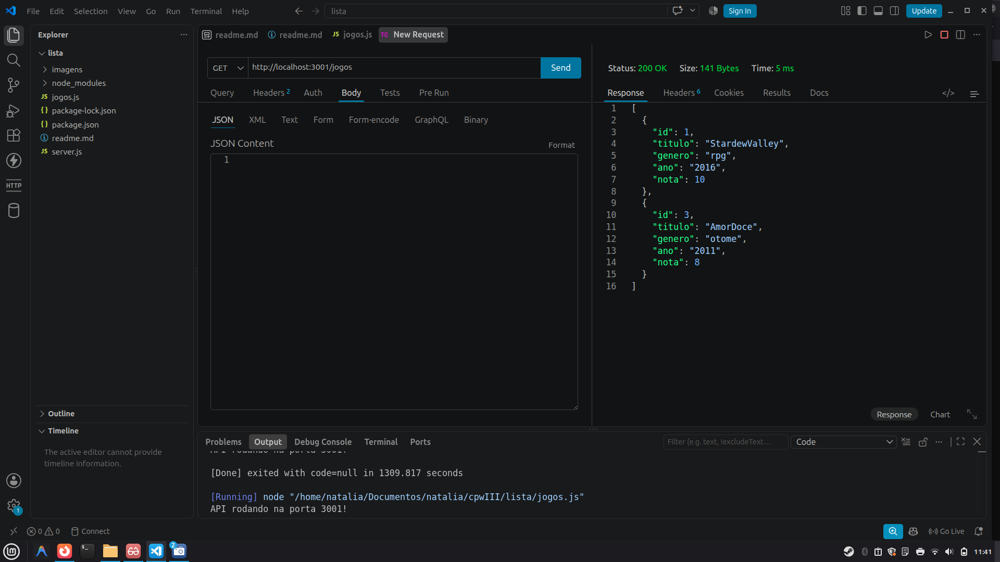  

  
     Parte 7 - Rota especial e manipulação de arrays
# 52. Crie GET /jogos/melhores.
# 53. Essa rota deverá retornar apenas jogos com nota maior ou igual a 8.
# 54. Utilize filter() para realizar a seleção.
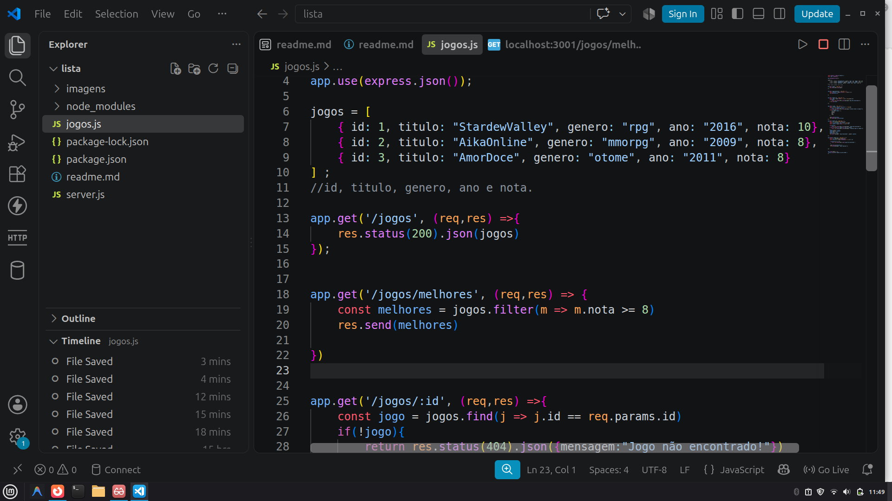  

# 55. Teste a rota no Postman.
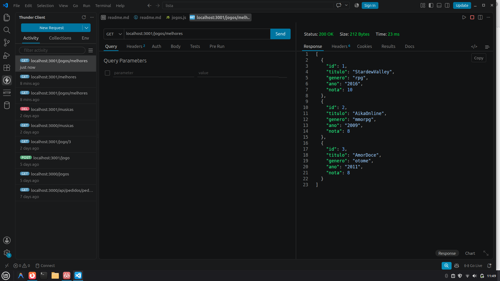  

# 56. Explique a diferença entre find(), findIndex() e filter().
find() retorna o  primeiro elemento que passar no teste.  
findIndex() retorna o indice do elemento que passar no teste.   
filter() retorna um array com os elementos que passarem no teste.  

# 57. Explique a diferença entre push() e splice().
push() adiciona novo elemento no final do vetor.
splice() serve para substituir, adicionar ou remover elemento em qualquer posição do vetor.

     Parte 8 - JSON: teoria e conversão
 # 58. Explique o que é JSON.
 É um arquivo feito para trocar informações entre o cliente eo servidor. Ele utilza texto simples para que 
 seja facil de interpretar.  

# 59. Explique a função de JSON.parse().
Serve para converter uma string em formato JSON para objeto javaScript.  

# 60. Explique a função de JSON.stringify().  
  Serve para converter valores javaScript para uma string em JSON.

# 61. Explique por que um arquivo JSON armazenado no disco precisa ser lido como texto antes de ser manipulado como objeto/array JavaScript.
Ele precisa ser lido como texto porque o JSON é um texto puro, eo javaScript precisa de uma estrutura viva na 
memória ram para funcionar. 

# 62. Explique a finalidade dos parâmetros null, 2 em JSON.stringify(dados, null, 2).
Serve para transformar um objeto em texto, deixando bem formatado.  
null é o parametro replacer, ele não filtra nada, converte o objeto inteiro com todas as propriedades.  
2 é o parametro space, quebra linhas e dá 2 espaços de recuo (indentação), evitando que o texto  fique em uma linha só.

# 63. Identifique pelo menos três regras de sintaxe de um JSON válido.
1.É obrigatório aspas duplas;  
 2.Não pode ter virgula após o ultimo elemento do objeto ou vetor;  
3.Tipo de dados restritos, JSON só aceita string, numeros e booleanos.  

# 64. Explique a diferença entre um objeto JavaScript em memória e o texto armazenado em um arquivo .json.
JavaScript é uma estrutura viva na memória ram que aceita funções,métodos e qualquer tipo de dado.  
O arquivo json é um texto puro, é limitado a dados brutos e regras mais rigídas.  
  
      Parte 9 - Persistência em arquivo JSON
# 65. Crie uma pasta dados e, dentro dela, o arquivo jogos.json.
# 66. Transfira os jogos iniciais para jogos.json.
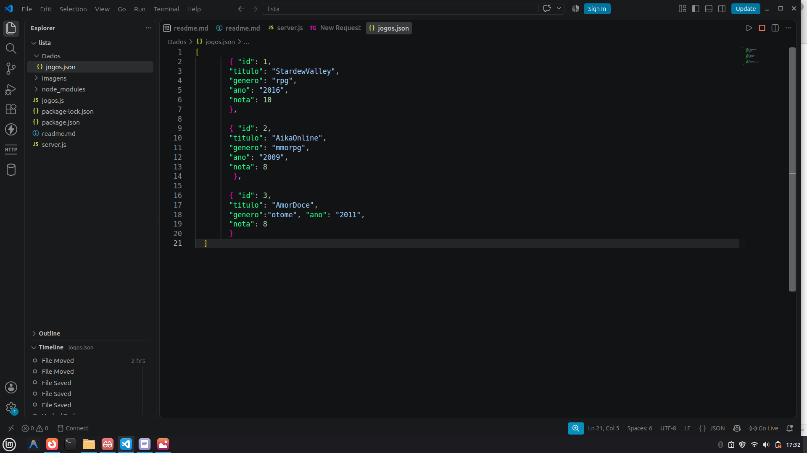

# 67. Leia o conteúdo de jogos.json utilizando o módulo fs.
# 68. Converta o conteúdo lido utilizando JSON.parse().
# 69. Faça GET /jogos retornar os dados lidos do arquivo, em vez de depender somente de um array criado diretamente no server.js.
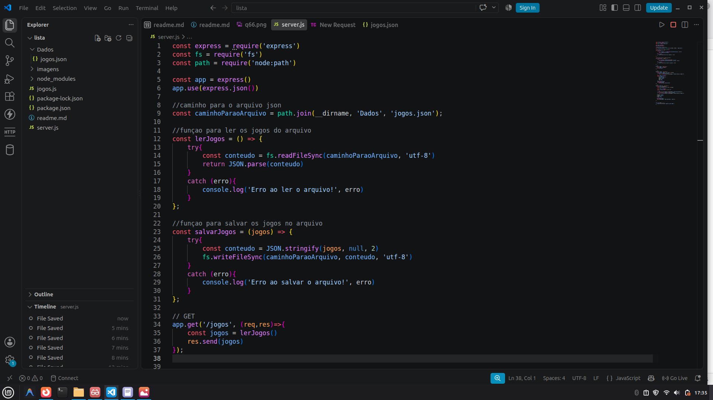

# 70. No POST /jogos, leia o arquivo, faça JSON.parse(), adicione o novo jogo com push(), converta novamente com JSON.stringify() e grave o arquivo.
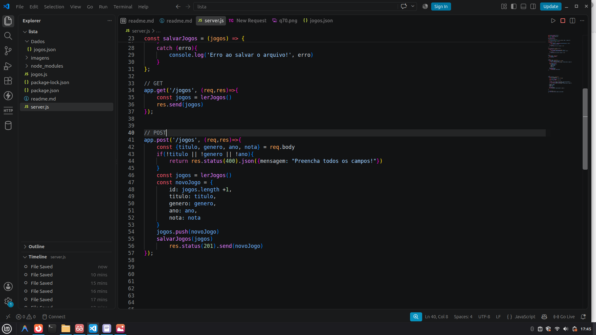
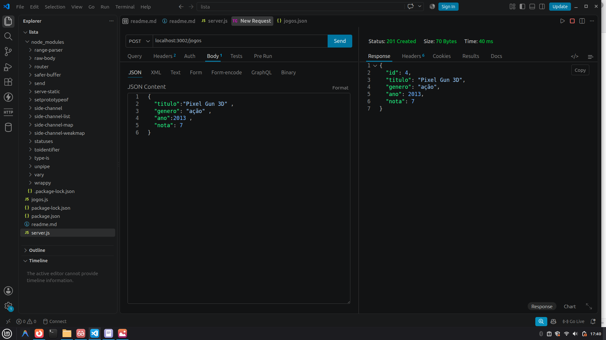

# 71. Depois de cadastrar um jogo pelo Postman, reinicie o servidor e comprove que o jogo continua cadastrado.
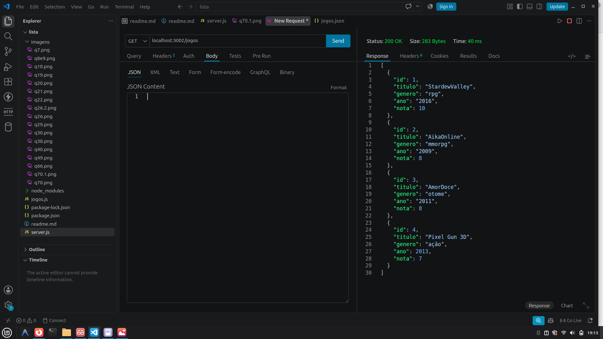

# 72. Explique por que os dados agora permanecem após o servidor ser desligado.
Porque eles foram gravados no disco rigido,diretamente dentro do arquivo jogos.json. Antes era perdido porque
ficava na memoria ram que é volatil e era apagado assim que o servidor era desligado.

# 73. Adapte o PUT para que a alteração também seja salva em jogos.json.
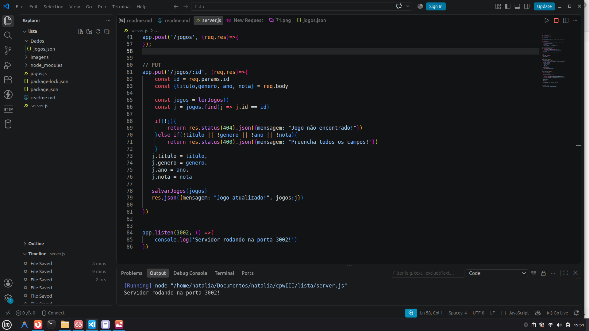

# 74. Adapte o DELETE para que a exclusão também seja salva em jogos.json.
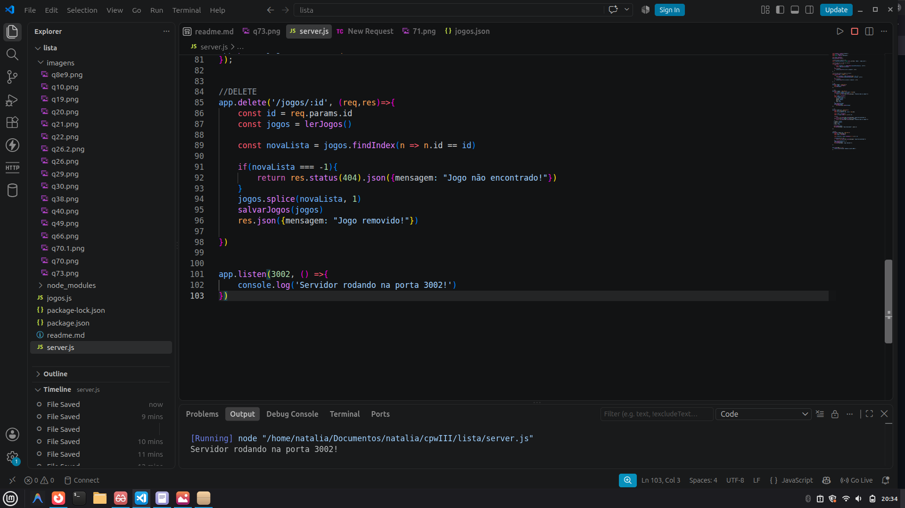

# 75. Teste novamente GET, POST, PUT e DELETE no Postman após implementar a persistência.
 # GET
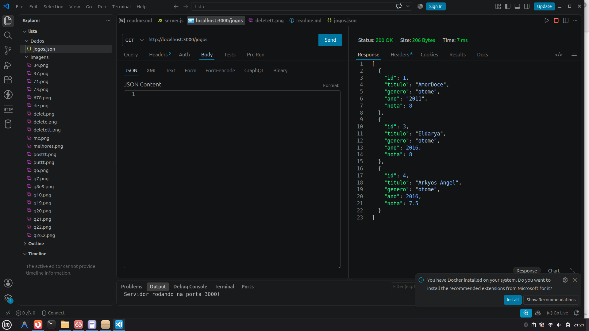  
  
# POST
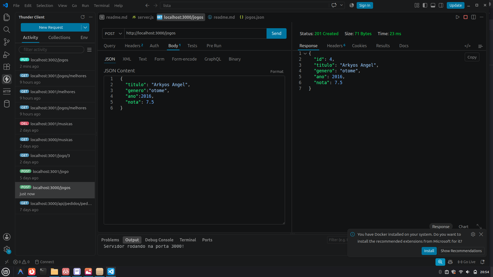   
  
# PUT
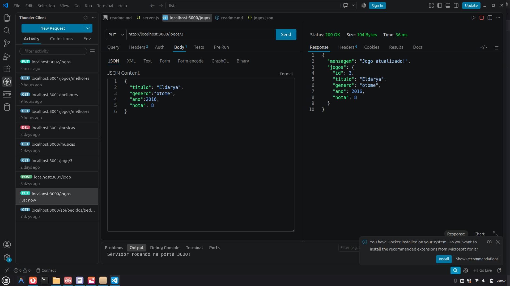 

# DELETE  
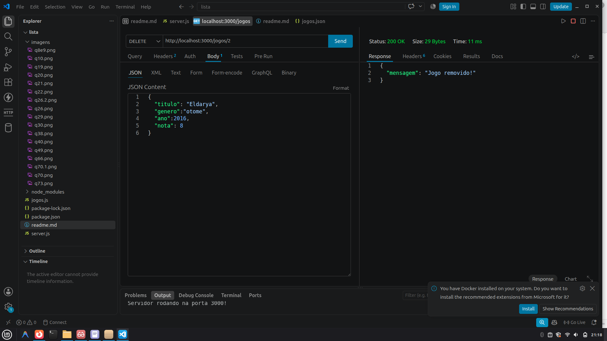 
   
      
      Parte 10 - Manipulação de arquivo TXT e histórico
# 76. Crie o arquivo historico.txt.
# 77. Sempre que um jogo for cadastrado, acrescente uma linha no histórico. Formato sugerido: JOGO CADASTRADO: Minecraft
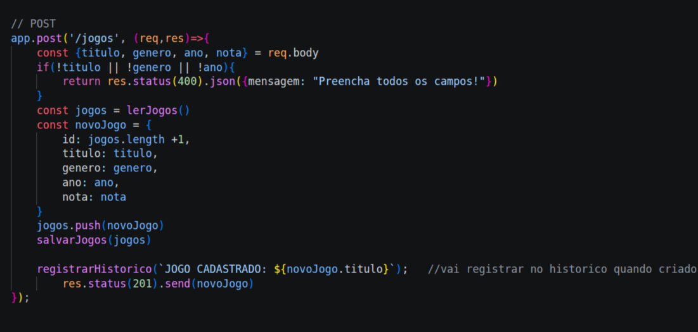 

# 78. Sempre que um jogo for atualizado, acrescente uma linha informando a atualização.
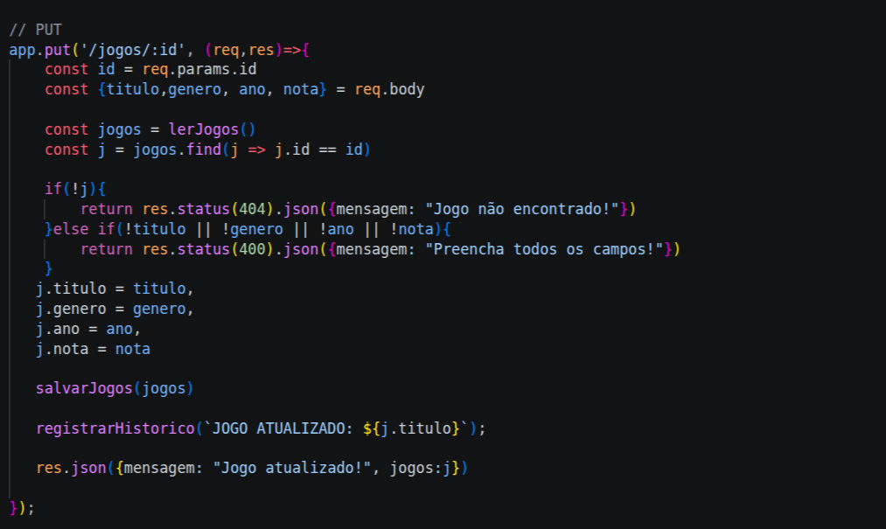 

# 79. Sempre que um jogo for removido, acrescente uma linha informando a remoção.
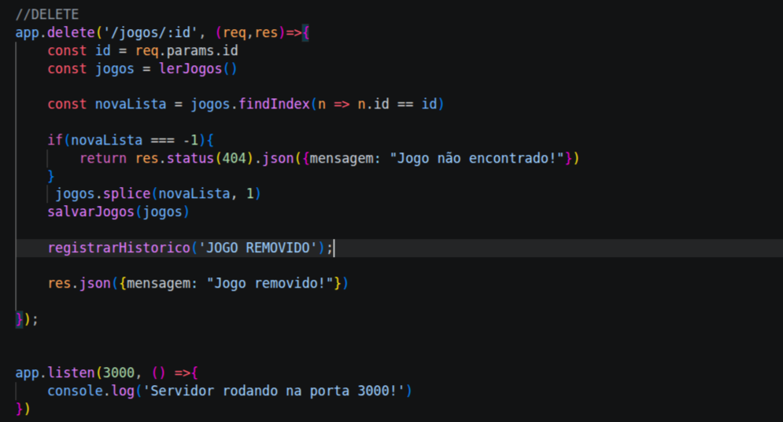 

# 80. Utilize appendFile ou appendFileSync para acrescentar dados sem apagar o conteúdo anterior.
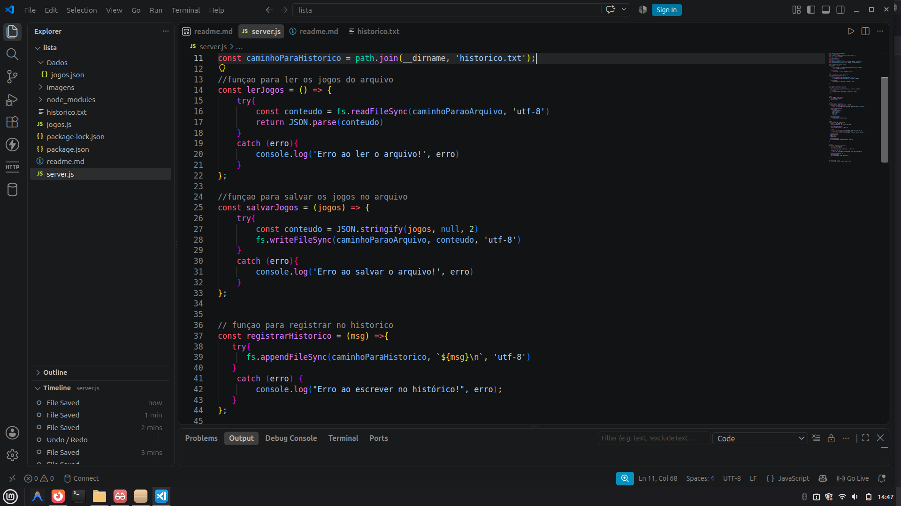 

# 81. Crie GET /historico para ler e retornar o conteúdo de historico.txt.
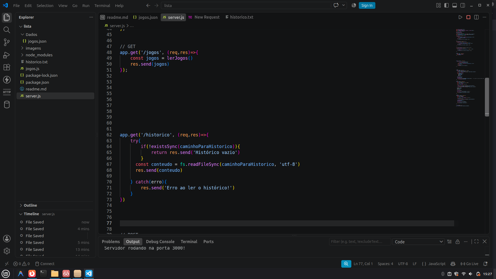 

# 82. Teste GET /historico no Postman.
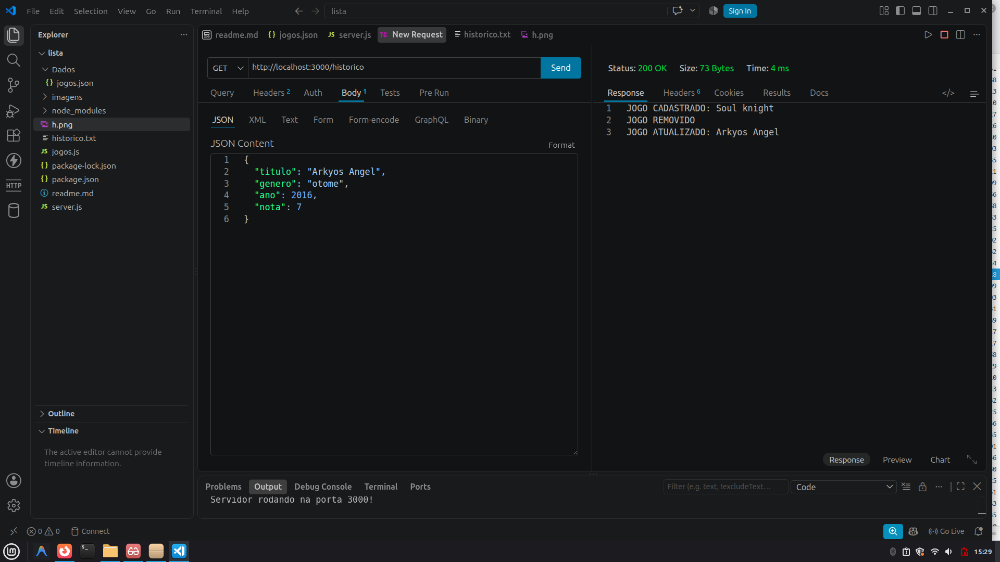 

# 83. Explique a diferença entre writeFile e appendFile.
WriteFile substitui o arquivo anterior e grava o novo conteudo por cima, o conteudo antigo é perdido.  
AppendFile não altera o histórico e anexa o novo conteudo no final do arquivo.

# 84. Explique o que pode acontecer com o conteúdo anterior de um arquivo quando writeFile é utilizado sobre um arquivo que já existe.
  O conteudo seria sobreescrito, porque o writeFile substitui o conteudo anterior pelo novo que ele escreveu.

# 85. Explique a finalidade de readFile.
É abrir e ler o conteudo do disco rigido , ele entrega para o código do node.js processar.
  
       
           
             Parte 11 - Exclusão de arquivos e módulo fs
# 86. Explique a função de fs.unlink().
 Serve para deletar um arquivo do disco rigido de forma assincrona.

# 87. Explique o que acontece quando fs.unlink() é usado para remover um arquivo.  

# 88. Associe as operações abaixo aos métodos de arquivo correspondentes: criar/escrever, ler, acrescentar e excluir.  
 Criar / escrever: fs.writeFile (ou fs.writeFileSync);  

 Ler: fs.readFile (ou fs.readFileSync);  

 Acrescentar: fs.appendFile (ou fs.appendFileSync);  

 Excluir: fs.unlink (ou fs.unlinkSync)

# 89. Explique o que significa o erro ENOENT.  
  É o código padrao do sistema que diz   'arquivo não encontrado' , acontece quando o node.js tentar achar um arquivo
  que não teve o caminho especifícado.

# 90. Cite uma situação do projeto em que ENOENT poderia ocorrer.
Poderia acontecer se eu desse um get de jogos antes de criar o arquivo jogos.json.   
   
              Parte 12 - path e caminhos de arquivos
# 91. Explique para que serve o módulo path do Node.js.
Serve para manipular e organizar caminhos de arquivos e pastas no node.js  

# 92. Explique por que escrever caminhos manualmente pode causar problemas entre Windows, Linux e macOS.  
O problema é que cada sistema operacional usa um caractere diferente para separar as pastas  
 o windows usa a contra barra  \, ex: dados\jogos.json.  
Ja linux e macOS usam a barra normal /, ex: dados/jogos.json.  
Se voce escrever manualmente o código vai dar erro quando for em rodar em um computador com SO diferente do seu.

# 93. Utilize path.join() para montar o caminho de jogos.json.  
const caminhoArquivoJ = path.join(__dirname, 'Dados', 'jogos.json');

# 94. Utilize path.join() para montar o caminho de historico.txt.
const caminhoArquivoH = path.join(__dirname, 'historico.txt');

# 95. Explique a vantagem de utilizar path.join() no projeto.
Ele faz o seu código rodar em qualquer computador. Descobre sozinho se você tá no windows, linux ou mac e coloca as barras do jeito certo automaticamente para não dar erro de arquivo não encontrado.
  

            Parte 13 - Tratamento de erros
# 96. Explique a função do bloco try/catch.  
A função do try/catch é evitar que o servidor caia quando acontece um erro.  
 O try  roda o código "perigoso" que pode dar alguma falha (como ler um arquivo).  
 O catch  só entra em ação se o erro acontecer, capturando a falha e deixando 
 o servidor continuar rodando normalmente.

# 97. Implemente tratamento de erro em pelo menos uma operação de leitura de arquivo.
# 98. Implemente tratamento de erro em pelo menos uma operação de escrita de arquivo.
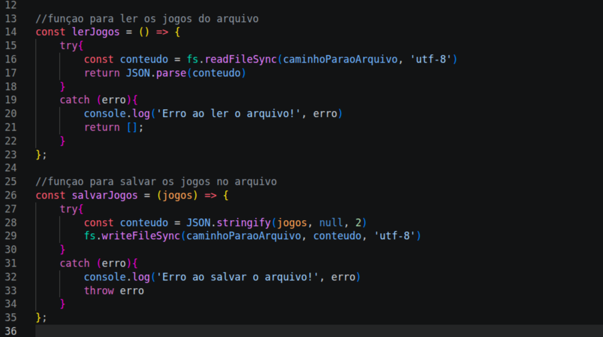 

# 99. Caso ocorra um erro interno inesperado em uma rota, retorne uma resposta de erro apropriada ao cliente.
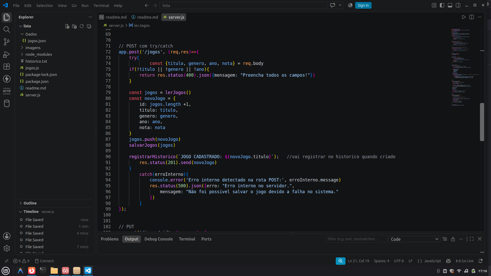 

# 100. Teste uma situação de erro controlado e descreva no README o que aconteceu. 
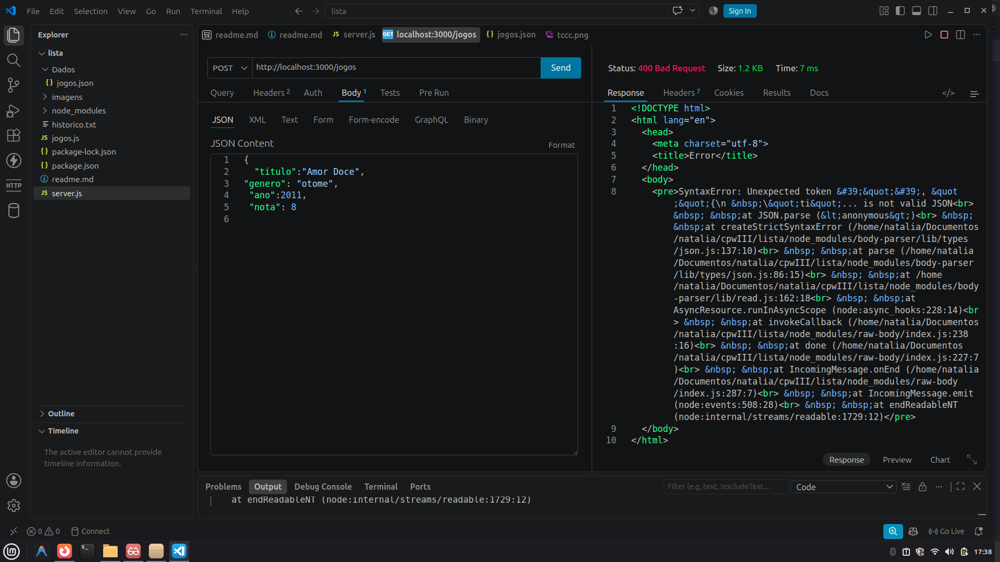 
 Deixei de colocar a ultima chave de propósito, eo express conseguiu detectar que o JSON estava quebrado.
 O servidor continuou rodando normalmente.

        Parte 14 - Síncrono, assíncrono e Event Loop
# 101. Explique a diferença entre uma operação síncrona e uma operação assíncrona.
Sincrona executa linha após a outra em fila, ela espera uma terminar para prosseguir.  
Assincrona executa as tarefas mais rapidas primeiro, e as mais demoradas ela deixa em segundo plano.  

# 102. Explique o que acontece com o servidor quando uma operação síncrona demorada bloqueia a execução.
O Node.js trabalha com uma única fila de execução, uma operação síncrona demorada trava o servidor inteiro. Enquanto essa operação roda, nenhum outro usuário consegue acessar as rotas do seu servidor, e isso 'bloqueia' o servidor.

# 103. Explique, de acordo com o conteúdo trabalhado, por que operações assíncronas são preferíveis em rotas de servidor.
Porque elas garantem que o servidor consiga atender milhares de pessoas ao mesmo tempo. O servidor fica livre para responder as requisições de outros usuários, sem deixar ninguém esperando na fila.

# 104. Explique o que é uma Promise.
A promise é como se fosse um recibo que o JS dá quando está fazendo uma tarefa demorada e esse 'recido' 
garante que voce receba uma de duas respostas: sucesso ou erro.

# 105. Explique a função de async.
 Async serve para definir uma função assíncrona em JavaScript. A função principal dele é permitir o uso do await dentro dela e garantir que a função sempre retorne uma Promise.

# 106. Explique a função de await.
Await serve para pausar a execução de uma função async até que uma Promise seja resolvida.

# 107. Compare readFileSync com readFile.
readFileSync lê o arquivo travando o servidor inteiro. Ninguém mais consegue usar a API enquanto ele não terminar.  
 readFile lê o arquivo em segundo plano. O servidor continua livre para atender outras pessoas ao mesmo tempo.

# 108. Se utilizar a versão assíncrona no projeto, envolva a operação em try/catch.
  
      Parte 15 - Middlewares
# 109. Explique o que é um middleware no Express.  
  É uma função intermediária que intercepta o pedido do cliente, ele poder ler e modificar esses dados e depois decide
  se passa a requisição para o servidor ou barra.

# 110. Explique por que express.json() pode ser considerado um middleware.
Porque ele atua no meio do caminho para interceptar os dados enviados pelo cliente. O express.json() pega o texto puro enviado no corpo da requisição, converte para um objeto JS e entrega pronto para a rota usar em req.body.

# 111. Cite duas outras responsabilidades que um middleware pode assumir em uma aplicação.  
Verificação e segurança, verifica se o usuario ta logado ou se ele tem permissão para acessar tal rota.  
Validar dados, verifica se o usuario inseriu todos os campos obrigatórios , antes de salvar no banco.

# 112. Explique em que momento o middleware atua no fluxo requisição -> rota -> resposta.
Logo após o cliente enviar a requisição e antes de chegar na rota final e enviar a resposta.
  
        Parte 16 - Sessões e Cookies - SOMENTE TEORIA

# 113. Explique por que o protocolo HTTP é considerado stateless.
Ele não guarda memória de requisições passadas. Cada pedido que o cliente faz ao servidor é isolado.
O servidor trata cada requisição como se fosse a primeira vez que vê aquele usuário.

# 114. Explique o que é um Cookie.
É um pequeno arquivo de texto que o servidor envia para o navegador do usuário. Ele guarda informações simples sobre a navegação, preferências ou identificadores, para que o navegador envie esses dados de volta ao servidor em todas as próximas visitas.

# 115. Explique o que é uma Sessão.
Sessão é um mecanismo que o servidor usa para lembrar do usuário e das suas ações durante o tempo em que ele estiver navegando no site.

# 116. Onde os dados de um Cookie ficam armazenados?
Fica guardado no navegador do cliente.

# 117. Onde os dados de uma Sessão ficam armazenados?
Fica no próprio servidor.

# 118. Explique como Cookie e Sessão podem trabalhar juntos para reconhecer um usuário entre diferentes requisições.
O servidor guarda seus dados na Sessão (armário) e te dá a chave (salva num Cookie). Toda vez que você clica em algo, seu navegador mostra a chave para o servidor saber qual armário é o seu.

# 119. Cite um exemplo de uso adequado para Cookie.
Guardar o idioma escolhido pelo visitante.

# 120. Cite um exemplo de uso adequado para Sessão.
Manter o usuario logado enquanto ele navega por outras paginas do site.

# 121. Explique, de forma conceitual, o que é Session ID.
O Session ID é um código único gerado pelo servidor para identificar cada usuário. Ele funciona como uma "comanda", permitindo que o cliente prove sua identidade sem carregar dados pesados de segurança.